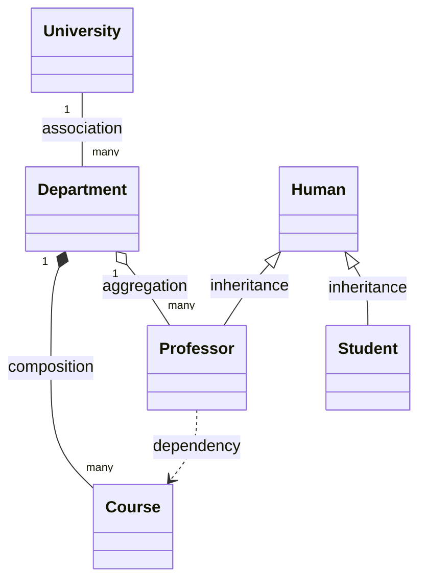

# Relation types
## Association

```c++

#include <vector>
#include <string>

class Departament;

class University{
    private:
        std::string name;
        std::vector<Departament*> departments;
    public:
        University(std::string name);
};

class Departament {
    private:
        std::string name;
    public:
        Departament(std::string name);
};

```

## Aggregation

```c++
    class Professor;

    class Department {
        private:
            std::string name;
            std::vector<Professor*> professors;
    public:
    Department(std::string name);
    void addProfessor(Professor* professor);
};

class Professor {
private:
    std::string name;
public:
    Professor(std::string name);
};
```

## Composition

```c++
    class Course;

class Department {
private:
    std::string name;
    std::vector<Course*> courses;
public:
    Department(std::string name);
    void addCourse(Course* course);
    ~Department() {
        for (auto course : courses) {
            delete course;
        }
    }
};

class Course {
private:
    std::string name;
public:
    Course(std::string name);
};


```


## inheritance

```c++

class Human {
public:
    std::string name;
    int age;
};

class Student : public Human {
    int course;
};

class Professor : public Human {
    std::vector<Course*> courses;
};

```

## dependency

```c++

class Course;

class Professor {
private:
    std::string name;
public:
    Professor(std::string name);
    void teachCourse(Course* course);
};

class Course {
private:
    std::string name;
public:
    Course(std::string name);
};

```
# class diagram
